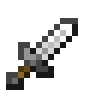

# Introduction

Vanilla Minecraft boasts two distinct melee weapons, the [sword](https://minecraft.wiki/w/Sword) and the [axe](https://minecraft.wiki/w/Axe). [Basic Weapons](https://modrinth.com/mod/basic-weapons) looks to expand on these two weapons with _5_ new offerings which have a distinct playstyle and optimal use scenario, much like vanilla weapons.

## What weapons are there?

Basic Weapons adds 5 new weapons

- { width="40" }[Dagger :material-arrow-right:](weapons/dagger.md)
- { width="40" }[Hammer :material-arrow-right:](weapons/hammer.md)
- { width="40" }[Club :material-arrow-right:](weapons/club.md)
- { width="40" }[Quarterstaff :material-arrow-right:](weapons/quarterstaff.md)
- { width="40" }[Spear :material-arrow-right:](weapons/spear.md)

## Which weapon should I use?

- `Dagger` - Low damage, high attack speed. This weapon works well for adventurers that need to be light on their feet in battle, dashing in and out of combat.
- `Hammer` - Very high damage, very low attack speed. This weapon can do staggering amounts of damage, and flings targets into the air. The hammer is quite situational - it won't shine much in most combat situations, but when it does, it _really_ does.
- `Club` - High damage, low attack speed. The club slows enemies briefly when hit, and works well as a weapon for those used to the vanilla sword that may want a little more damage and single target utility.
- `Quarterstaff` - Low damage, medium attack speed. The quarterstaff excels at multi-target crowd control. Like the vanilla sword, its sweeping attacks keep enemies at bay, but with higher attack speed it is comparatively more effective with large crowds.
- `Spear` - Medium damage, medium attack speed. This weapon is for those who like to keep their enemies at further than arm's reach. As long as [Better Combat](https://modrinth.com/mod/better-combat) is installed, the spear will be able to attack enemies around 4 blocks away from you - much further than standard weapons!

## Better Combat Integration

Basic Weapons works as a standalone mod, but really shines when paired with [Better Combat](https://modrinth.com/mod/better-combat). Better Combat overhauls Minecraft's combat system, adding fresh new animations for each weapon & enabling the spear to hit targets further away.
