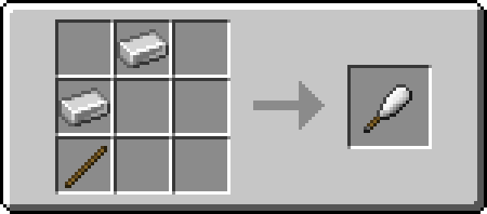
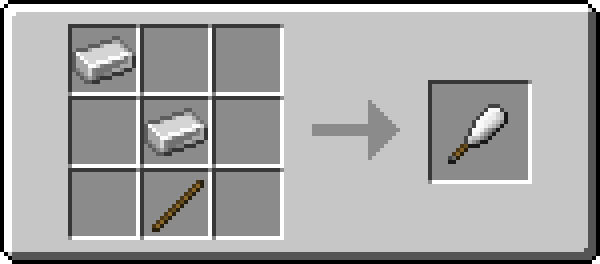

# Club

!!! example annotate inline end ""

    === "Wooden"
         

        | Damage                                                     | 6      |
        | ---------------------------------------------------------- | ------ |
        | Speed                                                      | 1      |
        | Reach [:material-information-outline:][bcombat]            | 2.5    |
        | Durability                                                 | 59     |
        | Special                                                    | Slow   |
        | Wielding [:material-information-outline:][bcombatwielding] | Single |

    === "Stone"

         

        | Damage                                                     | 7      |
        | ---------------------------------------------------------- | ------ |
        | Speed                                                      | 1      |
        | Reach [:material-information-outline:][bcombat]            | 2.5    |
        | Durability                                                 | 131    |
        | Special                                                    | Slow   |
        | Wielding [:material-information-outline:][bcombatwielding] | Single |

    === "Iron"

         

        | Damage                                                     | 8      |
        | ---------------------------------------------------------- | ------ |
        | Speed                                                      | 1      |
        | Reach [:material-information-outline:][bcombat]            | 2.5    |
        | Durability                                                 | 250    |
        | Special                                                    | Slow   |
        | Wielding [:material-information-outline:][bcombatwielding] | Single |

    === "Golden"

         

        | Damage                                                     | 6      |
        | ---------------------------------------------------------- | ------ |
        | Speed                                                      | 1      |
        | Reach [:material-information-outline:][bcombat]            | 2.5    |
        | Durability                                                 | 32     |
        | Special                                                    | Slow   |
        | Wielding [:material-information-outline:][bcombatwielding] | Single |

    === "Diamond"

         

        | Damage                                                     | 9      |
        | ---------------------------------------------------------- | ------ |
        | Speed                                                      | 1      |
        | Reach [:material-information-outline:][bcombat]            | 2.5    |
        | Durability                                                 | 1561   |
        | Special                                                    | Slow   |
        | Wielding [:material-information-outline:][bcombatwielding] | Single |

    === "Netherite"

         

        | Damage                                                     | 10     |
        | ---------------------------------------------------------- | ------ |
        | Speed                                                      | 1      |
        | Reach [:material-information-outline:][bcombat]            | 2.5    |
        | Durability                                                 | 2031   |
        | Special                                                    | Slow   |
        | Wielding [:material-information-outline:][bcombatwielding] | Single |

[bcombat]: #"Active with Better Combat installed"
[bcombatwielding]: #"Dual-wielding only applies with Better Combat installed"

:fontawesome-solid-bolt: Slow Enemies

The club is a one-handed melee weapon with high damage and low attack speed.

## Obtaining

{ width="420" }
{ width="420" }

In addition to crafting, the club can be found in loot chests across the overworld, nether and end.
