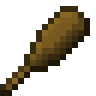
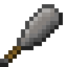
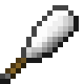
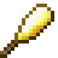
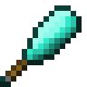
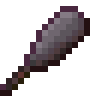

# Club

!!! example annotate inline end ""

    === "Wooden"
        

        | Damage                                          | 6           |
        | ----------------------------------------------- | ----------- |
        | Speed                                           | 1           |
        | Reach [:material-information-outline:][bcombat] | 2.5         |
        | Durability                                      | 59          |
        | Special                                         | Slow target |
        | Grip [:material-information-outline:][bcombat]  | One-handed  |

    === "Stone"

        

        | Damage                                          | 7           |
        | ----------------------------------------------- | ----------- |
        | Speed                                           | 1           |
        | Reach [:material-information-outline:][bcombat] | 2.5         |
        | Durability                                      | 131         |
        | Special                                         | Slow target |
        | Grip [:material-information-outline:][bcombat]  | One-handed  |

    === "Iron"

        

        | Damage                                          | 8           |
        | ----------------------------------------------- | ----------- |
        | Speed                                           | 1           |
        | Reach [:material-information-outline:][bcombat] | 2.5         |
        | Durability                                      | 250         |
        | Special                                         | Slow target |
        | Grip [:material-information-outline:][bcombat]  | One-handed  |

    === "Golden"

        

        | Damage                                          | 6           |
        | ----------------------------------------------- | ----------- |
        | Speed                                           | 1           |
        | Reach [:material-information-outline:][bcombat] | 2.5         |
        | Durability                                      | 32          |
        | Special                                         | Slow target |
        | Grip [:material-information-outline:][bcombat]  | One-handed  |

    === "Diamond"

        

        | Damage                                          | 9           |
        | ----------------------------------------------- | ----------- |
        | Speed                                           | 1           |
        | Reach [:material-information-outline:][bcombat] | 2.5         |
        | Durability                                      | 1561        |
        | Special                                         | Slow target |
        | Grip [:material-information-outline:][bcombat]  | One-handed  |

    === "Netherite"

        

        | Damage                                          | 10          |
        | ----------------------------------------------- | ----------- |
        | Speed                                           | 1           |
        | Reach [:material-information-outline:][bcombat] | 2.5         |
        | Durability                                      | 2031        |
        | Special                                         | Slow target |
        | Grip [:material-information-outline:][bcombat]  | One-handed  |

[bcombat]: #"Active with Better Combat installed"
