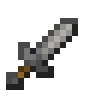
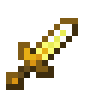
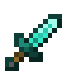
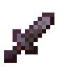

# Dagger

!!! example annotate inline end ""

    === "Wooden"
        

        | Damage                                                     | 2      |
        | ---------------------------------------------------------- | ------ |
        | Speed                                                      | 2      |
        | Reach [:material-information-outline:][bcombat]            | 2.25   |
        | Durability                                                 | 59     |
        | Special                                                    | N/A    |
        | Wielding [:material-information-outline:][bcombatwielding] | Single |

    === "Stone"

         

        | Damage                                                     | 3      |
        | ---------------------------------------------------------- | ------ |
        | Speed                                                      | 2      |
        | Reach [:material-information-outline:][bcombat]            | 2.25   |
        | Durability                                                 | 131    |
        | Special                                                    | N/A    |
        | Wielding [:material-information-outline:][bcombatwielding] | Single |

    === "Iron"

         

        | Damage                                                     | 4      |
        | ---------------------------------------------------------- | ------ |
        | Speed                                                      | 2      |
        | Reach [:material-information-outline:][bcombat]            | 2.25   |
        | Durability                                                 | 250    |
        | Special                                                    | N/A    |
        | Wielding [:material-information-outline:][bcombatwielding] | Single |

    === "Golden"

         

        | Damage                                                     | 1      |
        | ---------------------------------------------------------- | ------ |
        | Speed                                                      | 3      |
        | Reach [:material-information-outline:][bcombat]            | 2.25   |
        | Durability                                                 | 32     |
        | Special                                                    | N/A    |
        | Wielding [:material-information-outline:][bcombatwielding] | Single |

    === "Diamond"

         

        | Damage                                                     | 5      |
        | ---------------------------------------------------------- | ------ |
        | Speed                                                      | 2      |
        | Reach [:material-information-outline:][bcombat]            | 2.25   |
        | Durability                                                 | 1561   |
        | Special                                                    | N/A    |
        | Wielding [:material-information-outline:][bcombatwielding] | Single |

    === "Netherite"

         

        | Damage                                                     | 6      |
        | ---------------------------------------------------------- | ------ |
        | Speed                                                      | 2      |
        | Reach [:material-information-outline:][bcombat]            | 2.25   |
        | Durability                                                 | 2031   |
        | Special                                                    | N/A    |
        | Wielding [:material-information-outline:][bcombatwielding] | Single |

[bcombat]: #"Active with Better Combat installed"
[bcombatwielding]: #"Dual-wielding only applies with Better Combat installed"

:fontawesome-solid-bolt: Quick Attacks

The dagger is a cheap one-handed melee weapon with low damage and high attack speed. Like the vanilla sword, the dagger can also cut through cobwebs.

## Obtaining

{ width="420" }

In addition to crafting, the dagger can be found in loot chests across the overworld, nether and end.

## Demonstration

{ loading=lazy .demo-gif }
