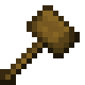
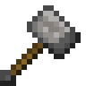
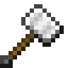
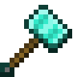
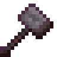
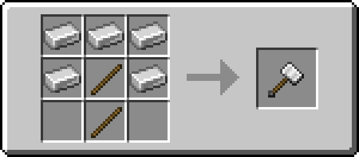

# Hammer

!!! example annotate inline end ""

    === "Wooden"
         

        | Damage                                                     | 2             |
        | ---------------------------------------------------------- | ------------- |
        | Speed                                                      | 1             |
        | Reach [:material-information-outline:][bcombat]            | 2.5           |
        | Durability                                                 | 59            |
        | Special                                                    | Fling |
        | Wielding [:material-information-outline:][bcombatwielding] | Single        |

    === "Stone"

         

        | Damage                                                     | 6             |
        | ---------------------------------------------------------- | ------------- |
        | Speed                                                      | 0.8           |
        | Reach [:material-information-outline:][bcombat]            | 2.5           |
        | Durability                                                 | 131           |
        | Special                                                    | Fling |
        | Wielding [:material-information-outline:][bcombatwielding] | Single        |

    === "Iron"

         

        | Damage                                                     | 10            |
        | ---------------------------------------------------------- | ------------- |
        | Speed                                                      | 0.5           |
        | Reach [:material-information-outline:][bcombat]            | 2.5           |
        | Durability                                                 | 250           |
        | Special                                                    | Fling |
        | Wielding [:material-information-outline:][bcombatwielding] | Single        |

    === "Golden"

         

        | Damage                                                     | 5             |
        | ---------------------------------------------------------- | ------------- |
        | Speed                                                      | 0.6           |
        | Reach [:material-information-outline:][bcombat]            | 2.5           |
        | Durability                                                 | 32            |
        | Special                                                    | Fling |
        | Wielding [:material-information-outline:][bcombatwielding] | Single        |

    === "Diamond"

         

        | Damage                                                     | 10            |
        | ---------------------------------------------------------- | ------------- |
        | Speed                                                      | 0.6           |
        | Reach [:material-information-outline:][bcombat]            | 2.5           |
        | Durability                                                 | 1561          |
        | Special                                                    | Fling |
        | Wielding [:material-information-outline:][bcombatwielding] | Single        |

    === "Netherite"

         

        | Damage                                                     | 11            |
        | ---------------------------------------------------------- | ------------- |
        | Speed                                                      | 0.6           |
        | Reach [:material-information-outline:][bcombat]            | 2.5           |
        | Durability                                                 | 2031          |
        | Special                                                    | Fling |
        | Wielding [:material-information-outline:][bcombatwielding] | Single        |

[bcombat]: #"Active with Better Combat installed"
[bcombatwielding]: #"Dual-wielding only applies with Better Combat installed"

:fontawesome-solid-bolt: Huge Damage, Fling Enemies

The hammer is an expensive one-handed melee weapon with very high damage and very low attack speed.

## Obtaining

{ width="420" }

In addition to crafting, the hammer can be found in loot chests across the overworld, nether and end.
