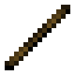
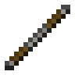
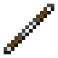
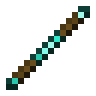
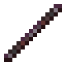
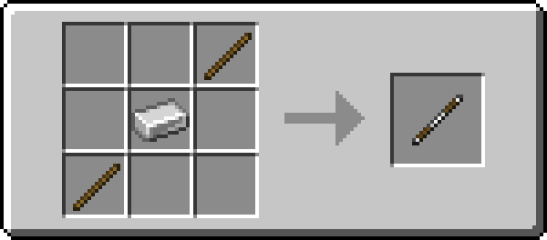

# Quarterstaff

!!! example annotate inline end ""

    === "Wooden"
         

        | Damage                                                     | 2        |
        | ---------------------------------------------------------- | -------- |
        | Speed                                                      | 1.7      |
        | Reach [:material-information-outline:][bcombat]            | 3.25     |
        | Durability                                                 | 59       |
        | Special                                                    | Sweeping |
        | Wielding [:material-information-outline:][bcombatwielding] | Dual     |

    === "Stone"

         

        | Damage                                                     | 3        |
        | ---------------------------------------------------------- | -------- |
        | Speed                                                      | 1.7      |
        | Reach [:material-information-outline:][bcombat]            | 3.25     |
        | Durability                                                 | 131      |
        | Special                                                    | Sweeping |
        | Wielding [:material-information-outline:][bcombatwielding] | Dual     |

    === "Iron"

         

        | Damage                                                     | 4        |
        | ---------------------------------------------------------- | -------- |
        | Speed                                                      | 1.7      |
        | Reach [:material-information-outline:][bcombat]            | 3.25     |
        | Durability                                                 | 250      |
        | Special                                                    | Sweeping |
        | Wielding [:material-information-outline:][bcombatwielding] | Dual     |

    === "Golden"

         

        | Damage                                                     | 2        |
        | ---------------------------------------------------------- | -------- |
        | Speed                                                      | 1.7      |
        | Reach [:material-information-outline:][bcombat]            | 3.25     |
        | Durability                                                 | 32       |
        | Special                                                    | Sweeping |
        | Wielding [:material-information-outline:][bcombatwielding] | Dual     |

    === "Diamond"

         

        | Damage                                                     | 5        |
        | ---------------------------------------------------------- | -------- |
        | Speed                                                      | 1.7      |
        | Reach [:material-information-outline:][bcombat]            | 3.25     |
        | Durability                                                 | 1561     |
        | Special                                                    | Sweeping |
        | Wielding [:material-information-outline:][bcombatwielding] | Dual     |

    === "Netherite"

         

        | Damage                                                     | 6        |
        | ---------------------------------------------------------- | -------- |
        | Speed                                                      | 1.7      |
        | Reach [:material-information-outline:][bcombat]            | 3.25     |
        | Durability                                                 | 2031     |
        | Special                                                    | Sweeping |
        | Wielding [:material-information-outline:][bcombatwielding] | Dual     |

[bcombat]: #"Active with Better Combat installed"
[bcombatwielding]: #"Dual-wielding only applies with Better Combat installed"

:fontawesome-solid-bolt: Crowd Control

The quarterstaff is a cheap two-handed melee weapon with low damage and medium attack speed.

## Obtaining

{ width="420" }

In addition to crafting, the quarterstaff can be found in loot chests across the overworld, nether and end.
