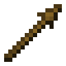

# Spear

!!! example annotate inline end ""

    === "Wooden"
         

        | Damage                                             | 3    |
        | -------------------------------------------------- | ---- |
        | Speed                                              | 1.2  |
        | Reach [:material-information-outline:][bcombat]    | 4.0  |
        | Durability                                         | 59   |
        | Special                                            | N/A  |
        | Wielding [:material-information-outline:][bcombatwielding] | Dual |

    === "Stone"

         

        | Damage                                             | 4    |
        | -------------------------------------------------- | ---- |
        | Speed                                              | 1.2  |
        | Reach [:material-information-outline:][bcombat]    | 4.0  |
        | Durability                                         | 131  |
        | Special                                            | N/A  |
        | Wielding [:material-information-outline:][bcombatwielding] | Dual |

    === "Iron"

         

        | Damage                                             | 5    |
        | -------------------------------------------------- | ---- |
        | Speed                                              | 1.2  |
        | Reach [:material-information-outline:][bcombat]    | 4.0  |
        | Durability                                         | 250  |
        | Special                                            | N/A  |
        | Wielding [:material-information-outline:][bcombatwielding] | Dual |

    === "Golden"

         

        | Damage                                             | 3    |
        | -------------------------------------------------- | ---- |
        | Speed                                              | 1.2  |
        | Reach [:material-information-outline:][bcombat]    | 4.0  |
        | Durability                                         | 32   |
        | Special                                            | N/A  |
        | Wielding [:material-information-outline:][bcombatwielding] | Dual |

    === "Diamond"

         

        | Damage                                             | 6    |
        | -------------------------------------------------- | ---- |
        | Speed                                              | 1.2  |
        | Reach [:material-information-outline:][bcombat]    | 4.0  |
        | Durability                                         | 1561 |
        | Special                                            | N/A  |
        | Wielding [:material-information-outline:][bcombatwielding] | Dual |

    === "Netherite"

         

        | Damage                                             | 7    |
        | -------------------------------------------------- | ---- |
        | Speed                                              | 1.2  |
        | Reach [:material-information-outline:][bcombat]    | 4.0  |
        | Durability                                         | 2031 |
        | Special                                            | N/A  |
        | Wielding [:material-information-outline:][bcombatwielding] | Dual |

[bcombat]: #"Active with Better Combat installed"
[bcombatwielding]: #"Dual-wielding only applies with Better Combat installed"
