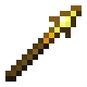
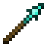

# Spear

!!! example annotate inline end ""

    === "Wooden"
        

        | Damage                                          | 3          |
        | ----------------------------------------------- | ---------- |
        | Speed                                           | 1.2        |
        | Reach [:material-information-outline:][bcombat] | 4.0        |
        | Durability                                      | 59         |
        | Special                                         | N/A        |
        | Grip [:material-information-outline:][bcombat]  | Two-handed |

    === "Stone"

        

        | Damage                                          | 4          |
        | ----------------------------------------------- | ---------- |
        | Speed                                           | 1.2        |
        | Reach [:material-information-outline:][bcombat] | 4.0        |
        | Durability                                      | 131        |
        | Special                                         | N/A        |
        | Grip [:material-information-outline:][bcombat]  | Two-handed |

    === "Iron"

        

        | Damage                                          | 5          |
        | ----------------------------------------------- | ---------- |
        | Speed                                           | 1.2        |
        | Reach [:material-information-outline:][bcombat] | 4.0        |
        | Durability                                      | 250        |
        | Special                                         | N/A        |
        | Grip [:material-information-outline:][bcombat]  | Two-handed |

    === "Golden"

        

        | Damage                                          | 3          |
        | ----------------------------------------------- | ---------- |
        | Speed                                           | 1.2        |
        | Reach [:material-information-outline:][bcombat] | 4.0        |
        | Durability                                      | 32         |
        | Special                                         | N/A        |
        | Grip [:material-information-outline:][bcombat]  | Two-handed |

    === "Diamond"

        

        | Damage                                          | 6          |
        | ----------------------------------------------- | ---------- |
        | Speed                                           | 1.2        |
        | Reach [:material-information-outline:][bcombat] | 4.0        |
        | Durability                                      | 1561       |
        | Special                                         | N/A        |
        | Grip [:material-information-outline:][bcombat]  | Two-handed |

    === "Netherite"

        

        | Damage                                          | 7          |
        | ----------------------------------------------- | ---------- |
        | Speed                                           | 1.2        |
        | Reach [:material-information-outline:][bcombat] | 4.0        |
        | Durability                                      | 2031       |
        | Special                                         | N/A        |
        | Grip [:material-information-outline:][bcombat]  | Two-handed |

[bcombat]: #"Active with Better Combat installed"
